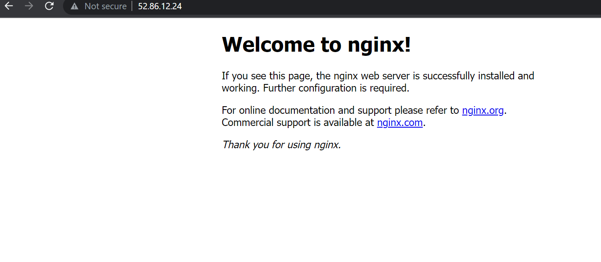
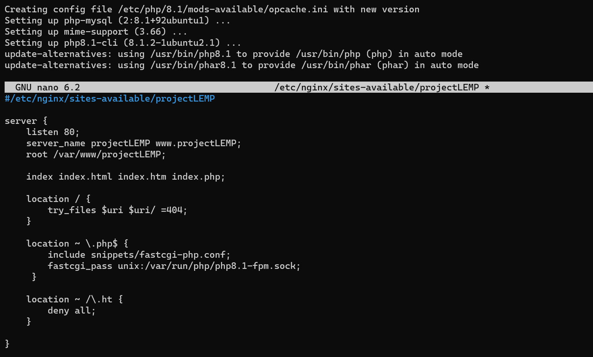
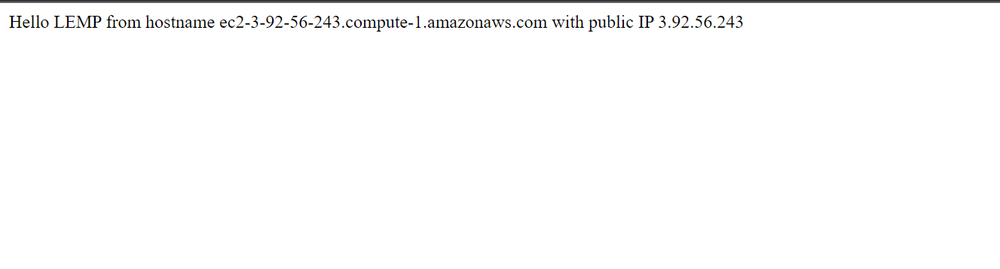
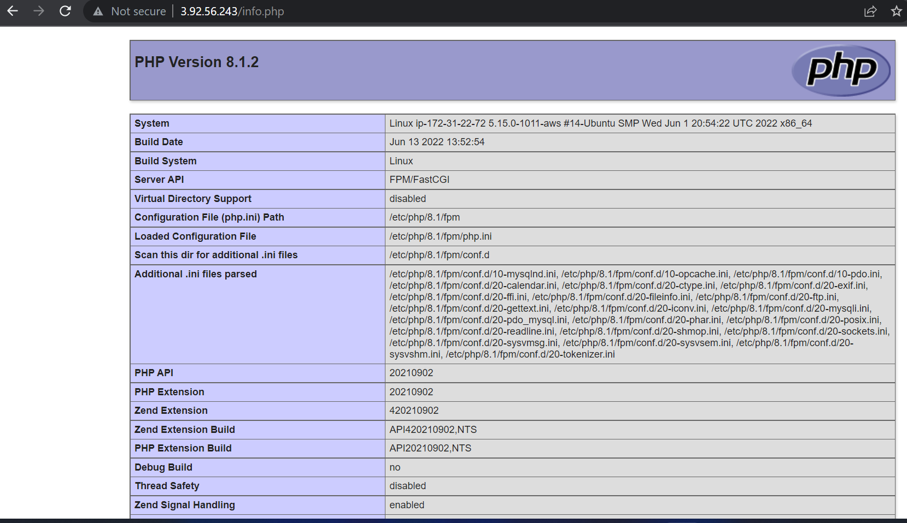

#  PROJECT 2: LEMP STACK IMPLEMENTATION
## STEP 1 – INSTALLING THE NGINX WEB SERVER

#### In order to display web pages to our site visitors, Nginx a high-performance web server needs to be installed. The `apt` package manager will be used to install this package
#### As `apt` is being used for the first time, updating the server’s package index is required. Following that, you can use apt install to get Nginx installed:

### Use the command `sudo apt update` to update

### Use the command `sudo apt install nginx` to install Nginx web server

### Use this command `sudo systemctl status nginx` to check the status of Nginx runnin as a service on Ubuntu

### The output above confirms the installation of a webserver (Nginx) in the cloud

### Before any traffic can be received  by the Web Server, `TCP port 80` default web browser port needs to be opened.

### `TCP port 22` is  open by default on EC2 machine to access it via SSH, so a rule needs to be  added to EC2 configuration to open inbound connection through `port 80:`

### Nginx web server is running and can be accessed  locally and from the Internet

### To access locally, use this command `curl http://localhost`

### To access externally, use this comaand `curl http://52.86.12.24`

### Accessing via a web browser displays the output below

# STEP 2 — INSTALLING MYSQL
### A relational database management system is required to manage & store data. MYSQL is RDBMS that will be installed.

### Use this command to install MYSQL `sudo apt install mysql-server`

### Use this command to logon to MYSQL `sudo MYSQL`

### It’s recommended that you run a security script that comes pre-installed with MySQL. This script will remove some insecure default settings and lock down access to your database system.

### Before running the script you will set a password for the root user, using mysql_native_password 

### Use this command to start running the interactive script `sudo mysql_secure_installation`
 ### Test Mysql login using this command `sudo mysql -p`
 

 # STEP 3 – INSTALLING PHP

 ### PHP is required to process code and generate dynamic content for the webserver

 ### While Apache embeds the PHP interpreter in each request, Nginx requires an external program to handle PHP processing and act as a bridge between the PHP interpreter itself and the web server. This allows for a better overall performance in most PHP-based websites, but it requires additional configuration. You’ll need to install php-fpm, which stands for “PHP fastCGI process manager”, and tell Nginx to pass PHP requests to this software for processing. Additionally, you’ll need php-mysql, a PHP module that allows PHP to communicate with MySQL-based databases. Core PHP packages will automatically be installed as dependencies

 ### To install these 2 packages at once, run: use this command `sudo apt install php-fpm php-mysql`
 

 # STEP 4 — CONFIGURING NGINX TO USE PHP PROCESSOR

 ### When using the Nginx web server, we can create server blocks (similar to virtual hosts in Apache) to encapsulate configuration details and host more than one domain on a single server. In this guide, we will use projectLEMP as an example domain name

 ### On Ubuntu 20.04, Nginx has one server block enabled by default and is configured to serve documents out of a directory at /var/www/html. While this works well for a single site, it can become difficult to manage if you are hosting multiple sites. Instead of modifying /var/www/html, we’ll create a directory structure within /var/www for the your_domain website, leaving /var/www/html in place as the default directory to be served if a client request does not match any other sites.

 ### Create the root web directory for your_domain using this command `sudo mkdir /var/www/projectLEMP`

 ### Next, assign ownership of the directory with the $USER environment variable, which will reference your current system user:

 ### Use this command to assign ownership `sudo chown -R $USER:$USER /var/www/projectLEMP`
 ### Then, open a new configuration file in Nginx’s sites-available directory using your preferred command-line editor. Here, we’ll use nano:

`sudo nano /etc/nginx/sites-available/projectLEMP`

### Activate your configuration by linking to the config file from Nginx’s sites-enabled directory: with the command below

`sudo ln -s /etc/nginx/sites-available/projectLEMP /etc/nginx/sites-enabled/`

### This will tell Nginx to use the configuration next time it is reloaded. You can test your configuration for syntax errors by typing: using this command `sudo nginx -t`

### Use this command `sudo unlink /etc/nginx/sites-enabled/default`to disable default Nginx host configured to listen on port 80

### Use this command `sudo systemctl reload nginx` to reload and apply changes

### Your new website is now active, but the web root /var/www/projectLEMP is still empty. Create an index.html file in that location so that we can test that your new server block works as expected:

`sudo echo 'Hello LEMP from hostname' $(curl -s http://169.254.169.254/latest/meta-data/public-hostname) 'with public IP' $(curl -s http://169.254.169.254/latest/meta-data/public-ipv4) > /var/www/projectLEMP/index.html`

# STEP 5 – TESTING PHP WITH NGINX
### At this point, your LAMP stack is completely installed and fully operational.

### You can test it to validate that Nginx can correctly hand .php files off to your PHP processor.

### You can do this by creating a test PHP file in your document root. Open a new file called info.php within your document root in your text editor:

### After checking the relevant information about your PHP server through that page, it’s best to remove the file you created as it contains sensitive information about your PHP environment and your Ubuntu server. You can use rm to remove that file:
`sudo rm /var/www/projectLEMP/info.php`

# Step 6 — Retrieving data from MySQL database with PHP

### In this step you will create a test database (DB) with simple "To do list" and configure access to it, so the Nginx website would be able to query data from the DB and display it.

### Use this command `CREATE DATABASE `example_database`;` to create a new database

### Use thus command `CREATE USER 'example_user'@'%' IDENTIFIED WITH mysql_native_password BY 'K33p@llS3cr3t01';` to create a new user using mysql_native_password as default authentication method.
### Use this command `GRANT ALL ON example_database.* TO 'example_user'@'%';` to grant permission to the user

### You can test if the new user has the proper permissions by logging in to the MySQL console again, this time using the custom user credentials:
`mysql -u example_user -p`

### Use this command `mysql -u example_user -p` to test custom credentials
### `SHOW DATABASES;` Gives the output below;

### Next, we’ll create a test table named todo_list. From the MySQL console, run the following statement:
### `CREATE TABLE example_database.todo_list (
### `item_id INT AUTO_INCREMENT,`
###  `content VARCHAR(255),`
###  `PRIMARY KEY(item_id));`

### Insert a few rows of content in the test table. You might want to repeat the next command a few times, using different VALUES:

`INSERT INTO example_database.todo_list (content) VALUES ("My first important item");`
### To confirm that the data was successfully saved to your table, run:

### Now you can create a PHP script that will connect to MySQL and query for your content. Create a new PHP file in your custom web root directory using your preferred editor. We’ll use vi for that:
`nano /var/www/projectLEMP/todo_list.php`

### You can now access this page in your web browser by visiting the domain name or public IP address configured for your website, followed by /todo_list.php:
`http://3.92.56.243/todo_list.phphttp://3.92.56.243/todo_list.php` displays the output below

!